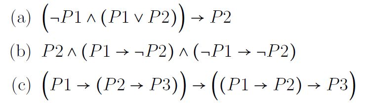
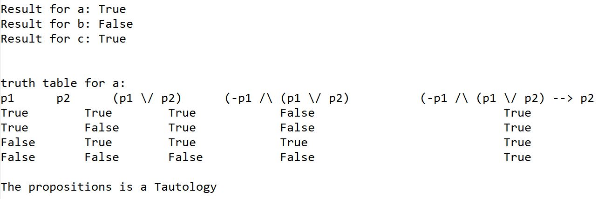

# propositional sentence evaluator
A Python program to calculate propositional sentences and outputs its truth table and its type of compound proposition

## What it does
First, the values of propositional variables P1, P2, and P3 are taken from the user. Unacceptable values are handled through error handling. Then, the program calculates the following propositional sentences:

### Results
The output is printed to the "results.txt" file. The results include:
* The truth value of each sentence
* The truth table for each sentence
* Whether the sentence is a Tautology, Contingency, or Contradiction

Sample output:
